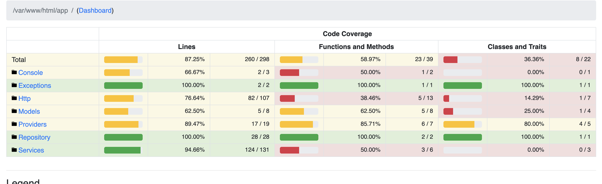

# Innoscripta Backend App

## Backend Setup

Min Requirements
 
`Php >= 8.1`

## Installation

### Install my-project with composer.phar

`cd Innoscripta-Task-Backend`

`php -d memory_limit=-1 composer.phar require laravel/sail --dev`

`php artisan sail:install `

### Update Env Variables before above command in .env.example file below one as per need

`DB_CONNECTION=mysql`

`DB_HOST=mysql`

`DB_PORT=3306`

`DB_DATABASE=InnoScripta`

`DB_USERNAME=admin`

`DB_PASSWORD=admin`

### Up Containers
`php composer.phar sail-down up`

### Down Containers
`php composer.phar sail-down`

## After it your app will serve at: 
http://localhost:8000/ if you go with defaults settings

Note: If you see on this url a break page then just do one thing run `php artisan optimize` inside container sometimes happens due to cache issue.

## API Collection: 
An postman collection is available /postman-collection

## TestCases Coverage : 

#### 1. To Check Whats The percentage of Test-Coverage Goto Container Terminal And Run:
`composer coverage`

#### 2. To Create Test-Coverage Report Goto Container Terminal And Run:
`composer phpunit-coverage`

#### Note: I will also Attach The Resultant ScreenShot Below

#### Test Percentage

#### Test Report

`This Report is present in ./coverage/index.html`.

## Authors

- [@mehmood](https://mehmoodshafiq205@gmail.com)
